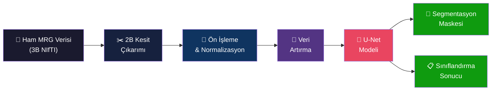
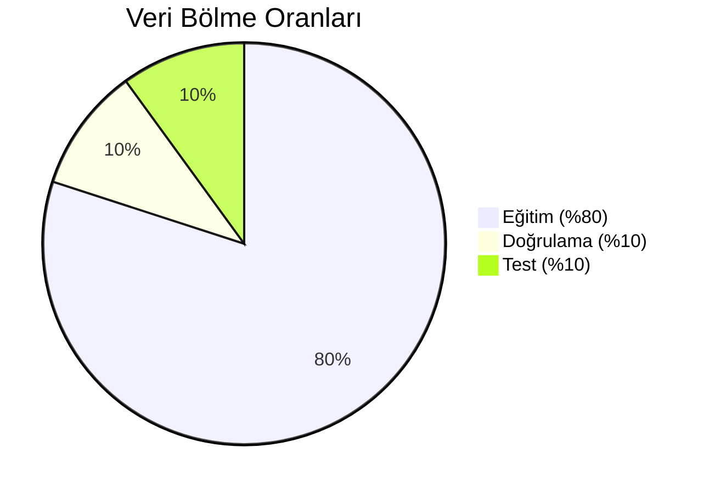
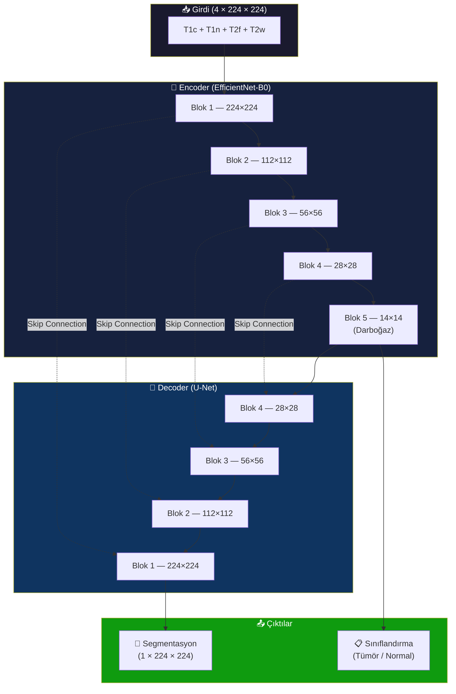
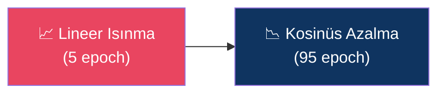

<p align="center">
  
  
  
  
</p>

<h1 align="center">🧠 Beyin MRG Tümör Segmentasyonu</h1>
<h3 align="center">Yapay Zekâ Destekli Otomatik Beyin Tümörü Tespit ve Bölütleme Sistemi</h3>

<p align="center">
  <b>TEKNOFEST 2026 — Sağlıkta Yapay Zekâ Yarışması</b>
</p>

---

## 📋 İçindekiler

- [Proje Özeti](#-proje-özeti)
- [Problem Tanımı](#-problem-tanımı)
- [Veri Seti](#-veri-seti)
- [Yöntem ve Yaklaşım](#-yöntem-ve-yaklaşım)
- [Model Mimarisi](#-model-mimarisi)
- [Eğitim Stratejisi](#-eğitim-stratejisi)
- [Değerlendirme Metrikleri](#-değerlendirme-metrikleri)
- [Sonuçlar](#-sonuçlar)
- [Kurulum ve Çalıştırma](#-kurulum-ve-çalıştırma)
- [Proje Yapısı](#-proje-yapısı)
- [Kısıtlamalar ve Gelecek Çalışmalar](#-kısıtlamalar-ve-gelecek-çalışmalar)
- [Kaynaklar](#-kaynaklar)
- [Lisans](#-lisans)

---

## 🎯 Proje Özeti

Bu proje, beyin Manyetik Rezonans Görüntüleme (MRG) taramalarından **tümör bölgelerinin otomatik olarak tespit edilmesi ve piksel düzeyinde bölütlenmesi** (segmentasyon) amacıyla geliştirilmiş derin öğrenme tabanlı bir yapay zekâ sistemidir.

Sistem, hastanın beyin MRG taramasını girdi olarak alır ve iki temel çıktı üretir:

| Görev | Açıklama |
|---|---|
| **Segmentasyon** | Tümörün piksel piksel sınırlarını belirleyen bir maske haritası |
| **Sınıflandırma** | Kesitte tümör var / yok ikili karar (güven skoru ile) |

> [!IMPORTANT]
> Bu sistem araştırma ve yarışma amaçlıdır. Klinik ortamda kullanılması için kapsamlı validasyon, regülatör onay ve klinik deneyler gereklidir.

---

## 🏥 Problem Tanımı

### Klinik Arka Plan

Beyin tümörleri, dünya genelinde en ölümcül kanser türleri arasında yer almaktadır. Erken ve doğru teşhis, tedavi planlamasının temelini oluşturur. MRG, beyin tümörlerinin tanısında **altın standart** görüntüleme yöntemidir çünkü:

- Yumuşak doku kontrastı üstündür
- İyonlaştırıcı radyasyon içermez
- Farklı modaliteler (sekanslar) farklı doku özelliklerini vurgular

### Mevcut Zorluklar

| Zorluk | Açıklama |
|---|---|
| **Manuel Değerlendirme Süresi** | Bir radyoloğun tek bir 3B MRG volumunu incelemesi 15-30 dakika sürebilir |
| **Gözlemciler Arası Değişkenlik** | Farklı radyologlar tümör sınırlarını farklı çizebilir (%10-20 varyans) |
| **Küçük Tümörlerin Kaçırılması** | Erken evre tümörler, özellikle yoğun iş yükü altında gözden kaçabilir |
| **Çoklu Modalite Entegrasyonu** | 4 farklı MRG sekansının eş zamanlı değerlendirilmesi bilişsel yük oluşturur |

### Çözüm Yaklaşımımız

Yapay zekâ tabanlı otomatik segmentasyon sistemi ile:

- ⏱️ Değerlendirme süresini **dakikalardan saniyelere** düşürüyoruz
- 🎯 Piksel düzeyinde **tutarlı ve tekrarlanabilir** sonuçlar sağlıyoruz
- 🧠 4 MRG modalitesini **eş zamanlı analiz** ederek bilgi kaybını önlüyoruz
- 📊 Güven skoru ile radyologa **karar destek** sunuyoruz

---

## 📊 Veri Seti

### Genel Bilgiler

Projede, uluslararası standartlarda hazırlanmış BraTS (Brain Tumor Segmentation) tarzı bir beyin MRG veri seti kullanılmaktadır. Veriler **NIfTI** (.nii.gz) formatında 3 boyutlu volumetrik taramalar olup, her hasta için dört farklı MRG sekansı mevcuttur.

### Veri Seti İstatistikleri

| Özellik | Değer |
|---|---|
| **Toplam Hasta Sayısı** | 203 |
| **Toplam Zaman Noktası** | 596 |
| **Toplam Dosya Sayısı** | 2.978 |
| **Veri Seti Boyutu** | 11,07 GB |
| **Dosya Formatı** | NIfTI (.nii.gz) — sıkıştırılmış 3B medikal görüntü |
| **Voksel Boyutları** | ~240 × 240 × 155 voksel (standart BraTS) |
| **Tümör Maskesi Oranı** | %99,7 (594/596 zaman noktası) |

### MRG Modaliteleri

Veri setinde her hasta taraması için **4 farklı MRG sekansı** bulunmaktadır. Bu sekanslar farklı doku özelliklerini vurgulayarak tümörün daha kapsamlı analiz edilmesini sağlar:

| Modalite | Kısaltma | Vurgulanan Özellik | Dosya Sayısı |
|---|---|---|---|
| **T1 Kontrastlı** | T1c | Aktif tümör dokusu, kan-beyin bariyeri bozulması | 596 |
| **T1 Natif** | T1n | Genel anatomi, beyin yapısı | 596 |
| **T2-FLAIR** | T2f | Ödem (şişme), infiltratif tümör | 596 |
| **T2 Ağırlıklı** | T2w | Sıvı içeriği, kistik yapılar | 596 |
| **Tümör Maskesi** | Maske | Piksel düzeyinde tümör anotasyonu | 594 |

### Hasta Başına Zaman Noktası Dağılımı

Aynı hastanın farklı zamanlardaki takip tetkikleri de veri setine dahildir:

| Zaman Noktası Sayısı | Hasta Sayısı |
|---|---|
| 1 tetkik | 48 hasta |
| 2 tetkik | 45 hasta |
| 3 tetkik | 50 hasta |
| 4 tetkik | 17 hasta |
| 5 tetkik | 18 hasta |
| 6 tetkik | 25 hasta |

> [!NOTE]
> Takip tetkikleri, tümörün zaman içindeki değişimini gözlemleme imkânı sunar. Aynı hastanın farklı zamanlardaki verileri, modelin genelleme yeteneğini artırır.

### Sınıf Dağılımı (2B Kesit Düzeyinde)

10 hastalık bir örneklem üzerinde yapılan analiz:

| Sınıf | Kesit Sayısı | Oran |
|---|---|---|
| **Tümörlü Kesitler** | 2.676 | %49,9 |
| **Tümörsüz Kesitler** | 2.688 | %50,1 |
| **Boş Kesitler (filtrelendi)** | 1.146 | — |

> Yaklaşık **dengeli** bir sınıf dağılımı mevcuttur. Buna rağmen, ağırlıklı örnekleme (Weighted Sampling) ile eğitim sırasında sınıf dengesizliğine karşı önlem alınmıştır.

---

## 🔬 Yöntem ve Yaklaşım

### Genel İş Akışı

Sistemin uçtan uca (end-to-end) çalışma akışı aşağıdaki gibidir:



### 1. Veri Hazırlama

#### 2B Kesit Çıkarımı

3B volumetrik MRG verisi (240×240×155 voksel), aksiyel düzlemde **2B kesitlere** ayrılmaktadır. Bu yaklaşımın tercih edilme nedenleri:

| Yaklaşım | Avantaj | Dezavantaj |
|---|---|---|
| **3B Model** | Kesitler arası bağlam korunur | ~57 MB/örnek, yüksek VRAM gereksinimi |
| **2B Model ✓** | ~0,9 MB/örnek, verimli eğitim | Kesitler arası bağlam kaybı |

4 GB VRAM kısıtı göz önüne alındığında, **2B kesit tabanlı yaklaşım** seçilmiştir. Bu sayede eğitim sırasında bellek verimliliği sağlanırken, her kesit bağımsız olarak işlenmektedir.

#### Boş Kesit Filtrasyonu

Beyin MRG volumunun üst ve alt uçlarındaki kesitler çoğunlukla beyin dokusu içermez. Bu kesitler modelin eğitiminde **gürültü** oluşturacağından, **%2'den az beyin dokusu** içeren kesitler otomatik olarak filtrelenmektedir.

### 2. Ön İşleme

#### Z-Skoru Normalizasyon

Her MRG modalitesi farklı sinyal yoğunluk aralıklarına sahiptir. Modalitateler arası tutarlılık sağlamak için her kanal bağımsız olarak **z-skoru normalizasyonu** uygulanmaktadır:

$$x_{norm} = \frac{x - \mu_{beyin}}{\sigma_{beyin} + \epsilon}$$

Burada μ ve σ yalnızca **beyin bölgesindeki** (sıfır olmayan) pikseller üzerinden hesaplanır. Bu yaklaşım, arka plan (hava) piksellerinin istatistikleri bozmasını önler.

#### Boyut Standardizasyonu

Tüm kesitler, model girdisi için **224×224 piksel** boyutuna yeniden ölçeklendirilmektedir. Bu boyut, hesaplama verimliliği ile çözünürlük arasında optimal dengeyi sağlamaktadır.

### 3. Veri Artırma (Data Augmentation)

Eğitim sırasında modelin genelleme yeteneğini artırmak ve aşırı öğrenmeyi (overfitting) önlemek amacıyla **tıbbi görüntülemeye uygun** veri artırma teknikleri uygulanmaktadır:

| Teknik | Açıklama | Olasılık |
|---|---|---|
| **Yatay Çevirme** | Sol-sağ simetri (beyin anatomisine uygun) | %50 |
| **Dikey Çevirme** | Nadir klinik senaryo ama çeşitlilik sağlar | %30 |
| **Döndürme (±15°)** | Hafif açısal varyasyonlar, anatomi korunur | %50 |
| **Elastik Deformasyon** | Doğal doku deformasyonlarını taklit eder | %30 |
| **Parlaklık/Kontrast** | Farklı MRG cihazları arası varyasyonu simüle eder | %40 |
| **Gauss Bulanıklığı** | Gürültü dayanıklılığını artırır | %20 |
| **Gauss Gürültüsü** | Sinyal gürültü oranı varyasyonu | %20 |

> [!TIP]
> Tıbbi görüntülemede aşırı geometrik deformasyon anatomik yapıları bozabilir. Bu nedenle döndürme ±15° ile sınırlandırılmış, ağır warping uygulanmamıştır.

### 4. Hasta Düzeyinde Veri Bölme

Veri sızıntısını (data leakage) önlemek için bölme işlemi **hasta düzeyinde** yapılmaktadır:



| Küme | Hasta Oranı | Amaç |
|---|---|---|
| **Eğitim (Train)** | %80 | Model ağırlıklarının öğrenilmesi |
| **Doğrulama (Validation)** | %10 | Hiperparametre ayarı, erken durdurma |
| **Test** | %10 | Nihai performans değerlendirmesi |

> [!CAUTION]
> Aynı hastanın farklı kesitleri **asla** farklı kümelere düşmez. Bu, modelin bir hastayı "ezberlemesi" yerine genel örüntüleri öğrenmesini garanti eder.

---

## 🏗️ Model Mimarisi

### U-Net + EfficientNet-B0

Model, medikal görüntü segmentasyonunda yaygın olarak kullanılan **U-Net** mimarisi üzerine inşa edilmiştir. Encoder kısmında, ImageNet üzerinde ön-eğitimli (pretrained) **EfficientNet-B0** ağı kullanılmaktadır.



### Mimari Detayları

| Bileşen | Detay |
|---|---|
| **Encoder** | EfficientNet-B0 (ImageNet ön-eğitimli) |
| **Decoder** | U-Net tarzı yukarı örneklemeli (upsampling) yapı |
| **Skip Connections** | Encoder → Decoder arası doğrudan bağlantılar (ince detay korunumu) |
| **Girdi Kanalları** | 4 (T1c, T1n, T2f, T2w aynı anda) |
| **Segmentasyon Çıktısı** | 1 kanal, 224×224 (tümör olasılık haritası) |
| **Sınıflandırma Başlığı** | Global Average Pooling → FC → Sigmoid |
| **Toplam Parametre** | ~6,3 milyon |
| **Eğitilebilir Parametre** | ~6,3 milyon |

### Transfer Öğrenme

EfficientNet-B0 encoder'ı, 1.4 milyon görüntüden oluşan **ImageNet** veri seti üzerinde ön-eğitilmiştir. Bu ön-eğitim:

- ✅ Kenar, doku ve şekil gibi **düşük seviye özelliklerin** zaten öğrenilmiş olmasını sağlar
- ✅ Sıfırdan eğitime kıyasla **daha hızlı yakınsama** (convergence) sunar
- ✅ Sınırlı tıbbi veri ile bile **güçlü genelleme** yapabilmesini mümkün kılar

### Neden U-Net?

U-Net, aşağıdaki nedenlerle medikal görüntü segmentasyonunda en yaygın kullanılan mimaridir:

1. **Skip connections** sayesinde ince anatomik detaylar korunur
2. Simetrik encoder-decoder yapısı segmentasyon için idealdir
3. Küçük veri setlerinde bile iyi performans gösterir
4. BraTS yarışmalarının çoğunda üst sıralarda U-Net tabanlı modeller yer alır

---

## ⚙️ Eğitim Stratejisi

### Hiperparametreler

| Hiperparametre | Değer | Gerekçe |
|---|---|---|
| **Batch Boyutu** | 4 | 4 GB VRAM kısıtı |
| **Gradyan Birikimi** | 8 adım | Efektif batch = 4 × 8 = 32 |
| **Öğrenme Oranı** | 1×10⁻³ | AdamW ile standart başlangıç |
| **Ağırlık Çürümesi** | 1×10⁻⁴ | Düzenlileştirme (regularization) |
| **Epoch Sayısı** | 100 | Erken durdurma ile |
| **Görüntü Boyutu** | 224×224 piksel | VRAM-çözünürlük dengesi |
| **Karışık Hassasiyet** | FP16 (AMP) | ~%40 bellek tasarrufu |
| **Gradyan Kontrol Noktası** | Aktif | ~%30 ek bellek tasarrufu |
| **Erken Durdurma** | 10 epoch sabır | Aşırı öğrenmeyi önler |

### Öğrenme Oranı Takvimi



1. **Isınma aşaması** (ilk 5 epoch): Öğrenme oranı 0'dan 1×10⁻³'e doğrusal olarak artar. Bu, eğitimin başında gradyan patlamasını (gradient explosion) önler.

2. **Kosinüs azalma** (kalan epoch'lar): Öğrenme oranı kosinüs fonksiyonu takip ederek yumuşak bir şekilde minimum değere (1×10⁻⁶) iner.

### Kayıp Fonksiyonu

Model, **iki görevli** (multi-task) bir kayıp fonksiyonu ile eğitilmektedir:

$$\mathcal{L}_{toplam} = 0{,}8 \times \mathcal{L}_{seg} + 0{,}2 \times \mathcal{L}_{cls}$$

| Kayıp | Formül | Amaç |
|---|---|---|
| **Segmentasyon** | 0,5 × Dice Loss + 0,5 × BCE Loss | Piksel düzeyinde tümör bölütleme |
| **Sınıflandırma** | BCE Loss | Kesit düzeyinde tümör var/yok |

**Dice Loss** doğrudan Dice katsayısını optimize ederken, **BCE Loss** özellikle küçük tümörlerde stabil gradyan sinyali sağlar. İki kayıp fonksiyonunun birleşimi, her iki görevde de güçlü performans elde edilmesini sağlar.

### GPU Bellek Optimizasyonları

4 GB VRAM'li NVIDIA RTX 3050 ile verimli eğitim için çeşitli optimizasyonlar uygulanmıştır:

| Optimizasyon | Bellek Tasarrufu | Açıklama |
|---|---|---|
| **Karışık Hassasiyet (FP16)** | ~%40 | FP32 yerine FP16 aritmetik |
| **Gradyan Kontrol Noktası** | ~%30 | Aktivasyonlar geri yayılım sırasında yeniden hesaplanır |
| **EfficientNet-B0** (B3 yerine) | ~%50 | 6,3M vs 13,2M parametre |
| **224×224** (256×256 yerine) | ~%25 | Daha küçük özellik haritaları |
| **Gradyan Birikimi** | — | Küçük batch ile büyük efektif batch |

> Tahmini toplam VRAM kullanımı: **~1,5-2 GB** (4 GB'nin yarısı — güvenli marj)

---

## 📏 Değerlendirme Metrikleri

### Segmentasyon Metrikleri

| Metrik | Formül | Açıklama |
|---|---|---|
| **Dice Katsayısı** | 2×TP / (2×TP + FP + FN) | Örtüşme ölçüsü (0-1, yüksek = iyi) |
| **IoU (Jaccard)** | TP / (TP + FP + FN) | Kesişim / Birleşim oranı |
| **Hassasiyet (Precision)** | TP / (TP + FP) | Yanlış pozitif oranını ölçer |
| **Duyarlılık (Recall)** | TP / (TP + FN) | Tümörün ne kadarının yakalandığını ölçer |
| **Doğruluk (Accuracy)** | (TP + TN) / Toplam | Genel piksel düzeyinde doğruluk |

### Sınıflandırma Metrikleri

| Metrik | Açıklama |
|---|---|
| **AUC-ROC** | Eğri altı alan — sınıflandırma gücünün genel göstergesi |
| **Karışıklık Matrisi** | TP, TN, FP, FN dağılımı |
| **F1-Skor** | Hassasiyet ve duyarlılığın harmonik ortalaması |

---

## 📈 Sonuçlar

### Eğitim İlerleme Kayıtları

> [!NOTE]
> Aşağıdaki sonuçlar, eğitim sürecinin mevcut durumunu yansıtmaktadır. Eğitim tamamlandığında bu tablo güncellenecektir.

| Metrik | Eğitim | Doğrulama |
|---|---|---|
| **Kayıp (Loss)** | 0,5315 | 0,4665 |
| **Dice Katsayısı** | 0,5113 | 0,5402 |
| **IoU** | 0,4044 | 0,4814 |
| **Hassasiyet (Precision)** | — | 0,5578 |
| **Duyarlılık (Recall)** | — | 0,8354 |
| **Doğruluk (Accuracy)** | — | 0,9957 |

### Hedef Performans

Tam veri seti ile eğitim tamamlandığında beklenen hedef değerler:

| Metrik | Hedef Aralık | BraTS Yarışma Ortalaması |
|---|---|---|
| **Dice Katsayısı** | 0,80 – 0,90 | 0,85+ |
| **IoU** | 0,70 – 0,85 | 0,75+ |
| **AUC-ROC** | 0,90+ | 0,92+ |

---

## 🚀 Kurulum ve Çalıştırma

### Gereksinimler

- Python 3.8+
- NVIDIA GPU (önerilir: 4+ GB VRAM)
- CUDA 12.x

### Hızlı Başlangıç

```bash
# 1. Sanal ortam oluşturma
python -m venv .venv
.venv\Scripts\activate  # Windows

# 2. Bağımlılıkları yükleme
pip install -r requirements.txt

# 3. PyTorch CUDA kurulumu (GPU için)
pip install torch torchvision --index-url https://download.pytorch.org/whl/cu126

# 4. Eğitim başlatma — %15 alt küme ile hızlı test
python train.py --epochs 50 --subset 0.15

# 5. Tam veri seti ile eğitim
python train.py --epochs 100 --subset 1.0

# 6. Model değerlendirme
python evaluate.py --subset 1.0

# 7. Tek hasta üzerinde çıkarım (inference)
python inference.py --input "Data/PatientID_0003/Timepoint_1" --output "results/"
```

---

## 📁 Proje Yapısı

```
TeknofestOnkoloji/
├── 📂 Data/                    # MRG veri seti (NIfTI dosyaları)
│   ├── PatientID_0003/
│   │   ├── Timepoint_1/
│   │   │   ├── *_brain_t1c.nii.gz
│   │   │   ├── *_brain_t1n.nii.gz
│   │   │   ├── *_brain_t2f.nii.gz
│   │   │   ├── *_brain_t2w.nii.gz
│   │   │   └── *_tumorMask.nii.gz
│   │   └── Timepoint_2/ ...
│   └── PatientID_0275/ ...
├── 📂 checkpoints/             # Eğitim kontrol noktaları
├── 📂 outputs/                 # Değerlendirme çıktıları
├── config.py                   # Merkezi ayar dosyası
├── dataset.py                  # Veri yükleme ve ön işleme
├── augmentations.py            # Veri artırma dönüşümleri
├── model.py                    # U-Net model mimarisi ve kayıp fonksiyonları
├── train.py                    # Eğitim döngüsü
├── evaluate.py                 # Test değerlendirmesi ve görselleştirme
├── inference.py                # Tek hasta çıkarım boru hattı
├── requirements.txt            # Python bağımlılıkları
└── README.md                   # Bu dosya
```

---

## ⚠️ Kısıtlamalar ve Gelecek Çalışmalar

### Mevcut Kısıtlamalar

| # | Kısıtlama | Açıklama |
|---|---|---|
| 1 | **2B Yaklaşım** | Kesitler arası uzamsal bağlam kaybedilir; 3B model ile daha iyi performans elde edilebilir |
| 2 | **İkili Segmentasyon** | BraTS veri setleri genellikle çok sınıflı etiketler içerir (nekrotik çekirdek, ödem, aktif tümör). Mevcut model bunları birleştirerek ikili maske üretir |
| 3 | **Veri Seti Boyutu** | 203 hasta, klinik ölçekte orta büyüklüktedir. Farklı cihaz ve protokollerden gelen verilere genelleme kapasitesi sınırlı olabilir |
| 4 | **Transfer Öğrenme** | EfficientNet, doğal görüntüler üzerinde ön-eğitilmiştir. MRG'ye özel ön-eğitim performansı artırabilir |

### Gelecek Geliştirmeler

- 🔬 **Çok sınıflı segmentasyon** — Tümör alt tiplerinin ayrı ayrı bölütlenmesi
- 🧊 **3B volümetrik model** — Daha güçlü GPU ile 3B U-Net veya nnU-Net denemesi
- 📱 **Web tabanlı arayüz** — Radyologlar için kullanıcı dostu görsel arayüz
- 🏥 **Çoklu kurum verisi** — Farklı hastanelerden veri ile genelleme testleri
- 🔄 **Aktif öğrenme** — Modelin en belirsiz olduğu örneklerin uzman anotasyonuna sunulması

---

## 📚 Kaynaklar

1. Ronneberger, O., Fischer, P., & Brox, T. (2015). *U-Net: Convolutional Networks for Biomedical Image Segmentation*. MICCAI.
2. Tan, M., & Le, Q. V. (2019). *EfficientNet: Rethinking Model Scaling for Convolutional Neural Networks*. ICML.
3. Menze, B. H., et al. (2015). *The Multimodal Brain Tumor Image Segmentation Benchmark (BRATS)*. IEEE TMI.
4. Isensee, F., et al. (2021). *nnU-Net: A Self-Configuring Method for Deep Learning-Based Biomedical Image Segmentation*. Nature Methods.
5. He, K., et al. (2016). *Deep Residual Learning for Image Recognition*. CVPR.

---

## 📜 Lisans

Bu proje **TEKNOFEST 2026 Sağlıkta Yapay Zekâ Yarışması** kapsamında geliştirilmiştir.

> ⚠️ **Uyarı:** Bu model araştırma ve yarışma amaçlıdır. Klinik ortamda tanı veya tedavi amaçlı kullanılamaz. Tıbbi karar süreçlerinde mutlaka uzman hekime danışılmalıdır.

---

<p align="center">
  <b>TEKNOFEST 2026 🇹🇷</b>
</p>
